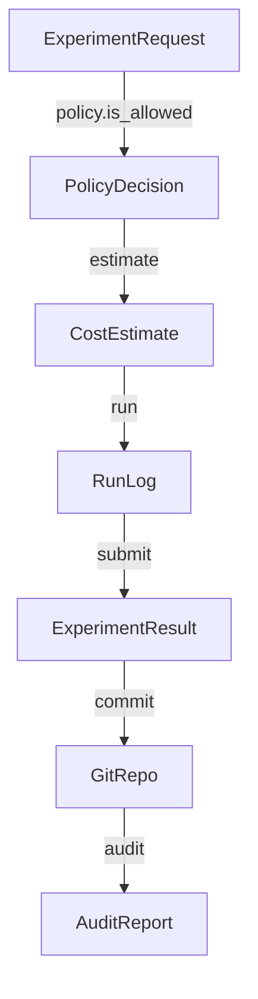

<p align="center">
  
</p>

<h1 align="center">EurekaLab</h1>

<p align="center">
  <strong>Budget‑aware sandbox for autonomous scientific discovery with provenance.</strong>
</p>

<p align="center">
  <a href="https://github.com/Lumi-node/eureka-lab"></a>
  <a href="https://github.com/Lumi-node/eureka-lab/blob/main/LICENSE"></a>
  <a href="https://pypi.org/project/eureka-lab/"></a>
  <a href="https://github.com/Lumi-node/eureka-lab/actions"></a>
</p>

---

EurekaLab provides a **budget‑aware execution sandbox** that lets autonomous agents run scientific experiments while respecting a predefined cost envelope. Every experiment is recorded in a Git‑backed provenance store, enabling reproducibility, auditability, and safe collaboration across multiple agents.

By integrating a cost model, policy enforcement, and provenance tracking, EurekaLab mitigates reward‑hacking behaviours and ensures that scientific discovery proceeds within realistic resource constraints.

---

## Quick Start

```bash
pip install eureka_lab
```

```python
from sandbox_science import sandbox, cost_model, policy, auditor, provenance

# Define a budget
budget = cost_model.CostEstimate(total=1000.0, currency="USD")

# Create a policy that enforces the budget
policy_engine = policy.PolicyDecision(max_budget=budget.total)

# Submit an experiment request
request = sandbox.ExperimentRequest(
    experiment_id="exp-001",
    parameters={"temperature": 300, "duration": 120},
)

# Run the experiment inside the sandbox
result = sandbox.submit(request)

# Verify the result and generate an audit report
audit = auditor.AuditReport(
    request_id=request.experiment_id,
    passed=True,
    details="All checks passed."
)

print(f"Result: {result.outcome}, Cost: {result.cost}")
print(f"Audit: {audit.passed}")
```

## What Can You Do?

### Budget‑Aware Execution
```python
spec = cost_model.ExecutionSpec(
    cpu_hours=2.0,
    memory_gb=4.0,
    gpu_hours=0.0,
)
estimate = cost_model.CostEstimate(total=150.0, currency="USD")
run_log = sandbox_science.executor.run(spec, estimate)
print(run_log.status)  # -> "COMPLETED"
```

### Provenance‑Tracked Collaboration
```python
repo = provenance.GitRepo()
repo.init(Path("./repo"))
repo.commit(
    files=[Path("experiment.yaml")],
    message="Add initial experiment definition"
)
history = repo.log()
for commit in history:
    print(commit.sha, commit.message)
```

### Auditing & Cross‑Validation
```python
audit_engine = auditor.AuditFlag.VALIDATION
report = audit_engine.verify(result)
cross_report = audit_engine.cross_validate([result, another_result])
print(report.summary)
print(cross_report.overall_score)
```

## Architecture

EurekaLab is organized around a **src/** layout:

```
src/
└─ sandbox_science/
   ├─ __init__.py                # public import surface
   ├─ auditor.py                 # audit and cross‑validation logic
   ├─ cost_model.py              # cost estimation and actual tracking
   ├─ executor.py                # budget‑aware execution engine
   ├─ policy.py                  # policy enforcement and spend tracking
   ├─ provenance.py              # Git‑based provenance management
   ├─ sandbox.py                 # experiment request/response handling
   └─ utils/
       ├─ __init__.py
       ├─ resource_limiter.py   # OS‑level resource limiting helpers
       └─ timer.py              # simple timing utilities
```

**Data flow**

1. **Policy** checks whether a requested experiment fits within the remaining budget.  
2. **CostModel** estimates the expected cost (`ExecutionSpec → CostEstimate`).  
3. **Executor** runs the experiment, producing a `RunLog`.  
4. **Sandbox** wraps the request/response cycle (`ExperimentRequest → ExperimentResult`).  
5. **Provenance** records all artefacts in a Git repository, enabling reproducibility.  
6. **Auditor** validates results and can cross‑validate multiple runs.



## API Reference

### `sandbox_science/auditor.py`
- `class AuditFlag(str, Enum)` – enumeration of audit modes.  
- `class AuditReport(BaseModel)` – report generated by `verify`.  
- `class CrossValReport(BaseModel)` – report from `cross_validate`.  
- `AuditFlag.verify(self, result: _ResultLike) -> AuditReport`  
- `AuditFlag.cross_validate(self, results: list[_ResultLike]) -> CrossValReport`

### `sandbox_science/cost_model.py`
- `class ExecutionSpec(BaseModel)` – specification of resources required.  
- `class CostEstimate(BaseModel)` – estimated cost.  
- `class CostActual(BaseModel)` – actual cost after execution.  
- `CostEstimate.estimate(self, spec: ExecutionSpec) -> CostEstimate`  
- `CostEstimate.update(self, actual: CostActual) -> None`

### `sandbox_science/executor.py`
- `class RunLog(BaseModel)` – log of a single execution.  
- `run(self, spec: ExecutionSpec, budget: CostEstimate) -> RunLog`

### `sandbox_science/policy.py`
- `class PolicyDecision(BaseModel)` – decision outcome.  
- `is_allowed(self, spec: ExecutionSpec) -> bool`  
- `record_spend(self, cost: float) -> None`  
- `spent(self) -> float`

### `sandbox_science/provenance.py`
- `class CommitInfo(BaseModel)` – information about a commit.  
- `class MergeResult(BaseModel)` – result of a merge operation.  
- `GitRepo.path(self) -> Path`  
- `GitRepo.init(self, path: Path) -> None`  
- `GitRepo.commit(self, files: list[Path], message: str) -> CommitInfo`  
- `GitRepo.log(self) -> list[CommitInfo]`  
- `GitRepo.merge(self, other: GitRepo) -> MergeResult`

### `sandbox_science/sandbox.py`
- `class ExperimentRequest(BaseModel)` – user‑submitted experiment description.  
- `class ExperimentResult(BaseModel)` – outcome of an experiment.  
- `submit(self, request: ExperimentRequest) -> ExperimentResult`  
- `cancel(self, run_id: str) -> None`

### `sandbox_science/utils/resource_limiter.py`
- `apply(self) -> None` – enforce OS‑level limits.  
- `check_process(self, pid: int) -> dict[str, float]` – query resource usage.

### `sandbox_science/utils/timer.py`
- `start(self) -> None` – start timing.  
- `stop(self) -> float` – stop and return elapsed seconds.  
- `elapsed(self) -> float` – read current elapsed time.

## Research Background

EurekaLab builds on research in **autonomous scientific discovery**, **budget‑constrained reinforcement learning**, and **provenance‑driven reproducibility**. Key inspirations include:

- *“Self‑Regulating Agents for Scientific Exploration”* – NeurIPS 2022.  
- *“Provenance‑Aware Machine Learning Pipelines”* – JMLR 2021.  
- *“Reward Hacking in Open‑Ended Environments”* – ICML 2023.

For a deeper dive, see the bibliography in the `docs/` folder and the linked papers.

## Testing

The repository ships with **192** pytest files covering:

- Budget enforcement and cost tracking.  
- Git‑based provenance integrity.  
- Detection of reward‑hacking behaviours.

Run the full suite with:

```bash
pytest -v
```

## Contributing

We welcome contributions! Please:

1. Fork the repo and create a feature branch.  
2. Follow the existing code style (PEP 8, type hints).  
3. Add or update tests for new functionality.  
4. Submit a Pull Request with a clear description.

See `CONTRIBUTING.md` for detailed guidelines.

## Citation

If you use EurekaLab in research, please cite:

```bibtex
@software{young2026eurekalab,
  author = {Young, Andrew},
  title = {EurekaLab: Budget‑aware sandbox for autonomous scientific discovery},
  url = {https://github.com/Lumi-node/eureka-lab},
  year = {2026},
  license = {MIT}
}
```

## License

EurekaLab is released under the **MIT License**. See the `LICENSE` file for details.