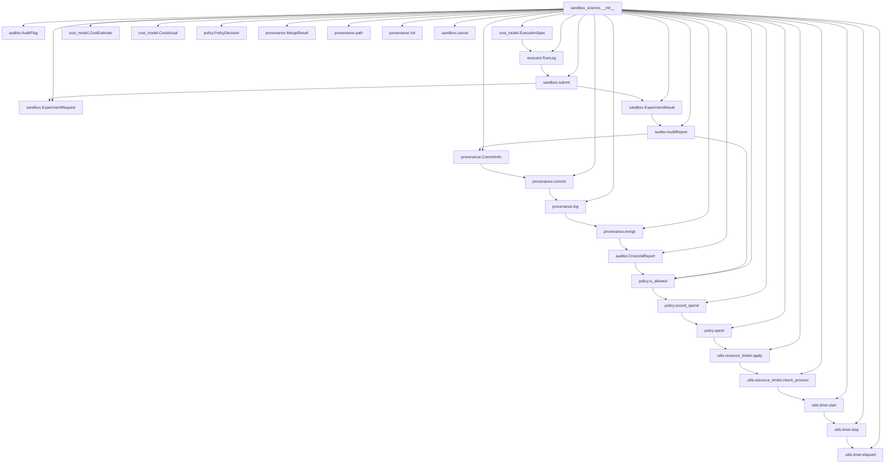

# Architecture – EurekaLab `sandbox_science`  

---  

## 1. System Overview  

`sandbox_science` is a **self‑regulating, budget‑aware execution sandbox** that lets data‑science teams run arbitrary experiments while automatically tracking provenance, enforcing cost policies, and detecting reward‑hacking attempts.  

* **Budget awareness** – Every experiment is described by an `ExecutionSpec`. The `CostModel` estimates the expected spend, the `Policy` checks that the estimate fits the remaining budget, and the `Executor` enforces a hard limit at runtime via the `resource_limiter`.  
* **Provenance‑tracked Git collaboration** – All input files, results, and audit reports are committed to a lightweight Git repository managed by the `Provenance` module. Merge operations are safe‑guarded by cross‑validation (`Auditor.cross_validate`).  
* **Reward‑hacking mitigation** – After each run the `Auditor` produces an `AuditReport`. The `Policy` records the cost of the run and, together with the `Auditor.cross_validate` step, flags any suspicious improvement that cannot be justified by the underlying data.  

The library is laid out under a `src/` directory, exposing a clean top‑level import surface (`import sandbox_science as ss`). All public symbols are re‑exported in `src/sandbox_science/__init__.py`.  

---  

## 2. Module Relationship Diagram  

---  

## 3. Module Descriptions  

| Module | Primary Classes / Functions | Role |
|--------|-----------------------------|------|
| **`sandbox_science/__init__.py`** | Re‑exports all public symbols | Provides a single import point (`import sandbox_science as ss`). |
| **`auditor.py`** | `AuditFlag`, `AuditReport`, `CrossValReport`, `verify`, `cross_validate` | Checks the scientific validity of a result. `verify` produces a per‑run `AuditReport`; `cross_validate` aggregates multiple reports to detect inconsistencies or reward‑hacking. |
| **`cost_model.py`** | `ExecutionSpec`, `CostEstimate`, `CostActual`, `estimate`, `update` | Translates a user‑provided experiment description into a cost estimate, and later reconciles the actual spend. |
| **`executor.py`** | `RunLog`, `run` | Executes the experiment inside a sandboxed subprocess, records runtime metrics, and returns a `RunLog`. |
| **`policy.py`** | `PolicyDecision`, `is_allowed`, `record_spend`, `spent` | Enforces budget constraints. `is_allowed` decides whether a run may start; `record_spend` updates the cumulative spend; `spent` reports the current consumption. |
| **`provenance.py`** | `CommitInfo`, `MergeResult`, `path`, `init`, `commit`, `log`, `merge` | Manages a lightweight Git repository that stores inputs, outputs, and audit artifacts. Guarantees reproducibility and enables safe merges of parallel experiment branches. |
| **`sandbox.py`** | `ExperimentRequest`, `ExperimentResult`, `submit`, `cancel` | Public façade for users. `submit` validates the request, asks the `Policy` for permission, runs the experiment via `Executor`, audits the result, and finally commits everything through `Provenance`. `cancel` aborts a running job (via PID stored in `RunLog`). |
| **`utils/resource_limiter.py`** | `apply`, `check_process` | Applies OS‑level resource limits (CPU, memory, wall‑time) to the child process. `check_process` can be polled to enforce soft limits. |
| **`utils/timer.py`** | `start`, `stop`, `elapsed` | Simple high‑resolution timer used by `Executor` to measure wall‑clock time and feed it into `RunLog`. |

---  

## 4. Data Flow  

1. **User request** – A client creates an `ExperimentRequest` (contains a `spec: ExecutionSpec`, optional data files, and a human‑readable description) and calls `sandbox.submit(request)`.  

2. **Budget check** – `submit` forwards `request.spec` to `CostModel.estimate`, receiving a `CostEstimate`. The `Policy.is_allowed(estimate)` method checks the remaining budget (`Policy.spent`). If the estimate exceeds the budget, an exception is raised and the request is rejected.  

3. **Resource preparation** – `Provenance.init` creates (or re‑uses) a Git repo at a dedicated experiment directory. Input files are staged, and a first commit records the raw request.  

4. **Execution** – `Executor.run(spec, budget)` spawns a subprocess. Before the child starts, `utils.resource_limiter.apply` installs hard limits derived from `budget`. The timer (`utils.timer`) is started, the child runs, and on termination the timer is stopped. A `RunLog` is built containing:  

   * `run_id` (UUID)  
   * `pid` of the child process  
   * `wall_time` (from `timer.elapsed`)  
   * `cpu_time`, `memory_peak` (from `resource_limiter.check_process`)  
   * `exit_code` and any stdout/stderr capture  

5. **Cost reconciliation** – `CostModel.update` receives a `CostActual` (populated from `RunLog`) and adjusts internal bookkeeping. The actual spend is added to the policy via `Policy.record_spend(actual.cost)`.  

6. **Auditing** – `Auditor.verify(run_log)` produces an `AuditReport` that includes:  

   * `flag` (`AuditFlag.PASS`, `FAIL`, `SUSPICIOUS`)  
   * `metrics` (e.g., achieved accuracy, loss)  
   * `cost` (the actual spend)  

   The report is stored as a JSON artifact and committed to the repo (`Provenance.commit`).  

7. **Cross‑validation (optional)** – When multiple runs of the same experiment exist (e.g., hyper‑parameter sweeps), the caller may invoke `Auditor.cross_validate([reports])`. This aggregates the reports into a `CrossValReport` that flags any result that appears to “game” the reward (e.g., dramatically better metric with unchanged data). If `CrossValReport` contains a `SUSPICIOUS` flag, the `Policy` can be instructed to reject further runs of that experiment.  

8. **Result assembly** – `ExperimentResult` is built from the `RunLog`, the final `AuditReport`, and the latest commit hash. It is returned to the caller and also persisted in the Git repo.  

9. **Cancellation** – If the user calls `sandbox.cancel(run_id)`, the stored PID from the corresponding `RunLog` is sent a termination signal. The `RunLog` is updated to reflect the aborted state, and the partial run is still recorded for auditability.  

---  

### Summary  

The architecture cleanly separates **policy**, **cost**, **execution**, **audit**, and **provenance** concerns while keeping the public API tiny (`sandbox.submit`, `sandbox.cancel`). The Mermaid diagram visualises the dependencies, and the data‑flow description shows how a request travels through the system, guaranteeing that every experiment is budget‑constrained, reproducibly versioned, and scientifically validated.